# Background

In a disease outbreak, knowledge about who-infected-who can be crucial in managing the trajectory of the epidemic.
Since it is routine these days to sequence pathogens in serious outbreaks, it becomes appealing to use these sequences in making inferences about who-infected-who.
The BREATH model  allows simultaneous inference of the phylogeny of the pathogen and transmission amongst hosts, including unsampled hosts.
This has a number of benefits over existing methods for inference who-infected-who:

* It captures phylogenetic uncertainty impacting tranmission chains more accurately than when a phylogeny is inferred first, and then transmissions are inferred on a summary tree.
* It provides a tree generating process that we can use as tree prior, thus more accurately describing our prior knowledge about how the phylogeny evolved than if we are using standard coalescent or birth-death based tree priors.
* It can deal with hosts that were not sampled but are part of the transmission chain.
* The analysis can be set up in BEAUti, the graphical user interface for BEAST.

There are some limitations that need to be taken in account:

* Good knowledge about the transmission process is required in order to be able to specify the parameters of the transmission hazard -- one of the input for the transmission tree likelihood.
* Likewise, good knowledge about the sampling process is required: what time does it take between a host getting infected and getting sampled, and what is the probability of being sampled. This information is required to specify the sampling hazard parameters.
* If the goal of the analysis is to infer who-infected-who from the data, this kind of analysis assumes that the hosts are densely sampled, with at least 50% of the hosts being sampled. If fewer hosts are sampled, little information about the who-infected-who process can be inferred, though the method still can be used as tree prior.

----

# Programs used in this Exercise

### BEAST2 - Bayesian Evolutionary Analysis Sampling Trees 2

BEAST2 is a free software package for Bayesian evolutionary analysis of molecular sequences using MCMC and strictly oriented toward inference using rooted, time-measured phylogenetic trees . This tutorial uses the BEAST2 version 2.7.5.

### BEAUti2 - Bayesian Evolutionary Analysis Utility

BEAUti2 is a graphical user interface tool for generating BEAST2 XML configuration files.

Both BEAST2 and BEAUti2 are Java programs, which means that the exact same code runs on all platforms. For us it simply means that the interface will be the same on all platforms. The screenshots used in this tutorial are taken on a Mac OS X computer; however, both programs will have the same layout and functionality on both Windows and Linux. BEAUti2 is provided as a part of the BEAST2 package so you do not need to install it separately.

### Tracer

Tracer is used to summarise the posterior estimates of the various parameters sampled by the Markov Chain. This program can be used for visual inspection and to assess convergence. It helps to quickly view median estimates and 95% highest posterior density intervals of the parameters, and calculates the effective sample sizes (ESS) of parameters. It can also be used to investigate potential parameter correlations. We will be using Tracer v1.7.0.

----

# Practical: BREATH Tree Analysis

We will set up an analysis in BEAUti using a BREATH tree prior of a tuberculosis outbreak in Hamburg, Germany, earlier analysed in .
To reduce run-time, we only analyse a subset of 40 samples, then run BEAST and analyse the results. 
We will be using the `BREATH` package, so make sure it is installed, like so:

> * Start BEAUti
> * Click to the `File => Manage packages` menu item.
> * Select `BREATH` in the list of packages and the click `Install` button.
If `BREATH` is not in the list of packages, you must add a package repository first like so: in the package manager, click `Package repositories` button, then click `Add URL` in the window that pops up, where you can put `https://raw.githubusercontent.com/CompEvol/CBAN/master/packages-extra-2.7.xml` in the text field. Then return to the package manager window where the `BREATH` package should appear.
> * Close BEAUti -- it needs to restart to pick up the new packages.

## Set up in BEAUti

> * Start BEAUti -- it should open with the Standard template.
> * Next, select the `File => Import Alignment` menu.

A dialog is shown where you can select a file containing a tree in NEXUS format.

> Select the file `roetzer40.nex` that comes with this tutorial in the data section.

<figure>
	<a id="fig:BEAUti1"></a>
	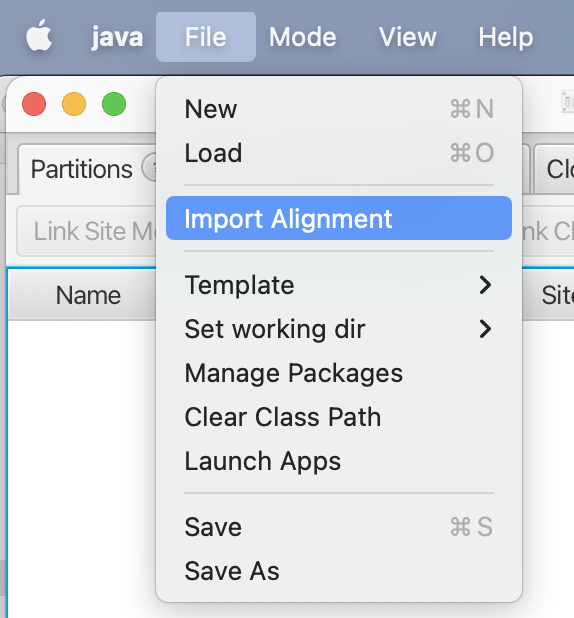
	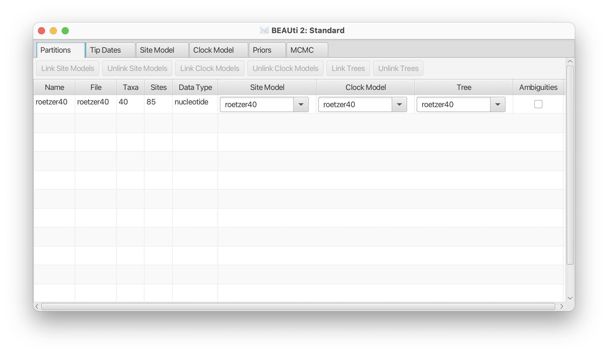
	<figcaption>Figure: Add partition through the `File => Import Imprt` menu.</figcaption>
</figure>

In the partition panel, a new partition will be added with the name roetzer40. 
Next, we will set up tip dates.

> * Click on the `Tip Dates` tab.
> * Select the `Use tip dates` checkbox.
> * Click the `as dates with format` and select `yyyy-M-dd` from the drop down box.
> * Click the `Auto-configure` button
> * A dialog pops up. We want everything after the first colon, so change the underscore in the first entry to `:` and click the `OK` button.

<figure>
	<a id="fig:BEAUti2"></a>
	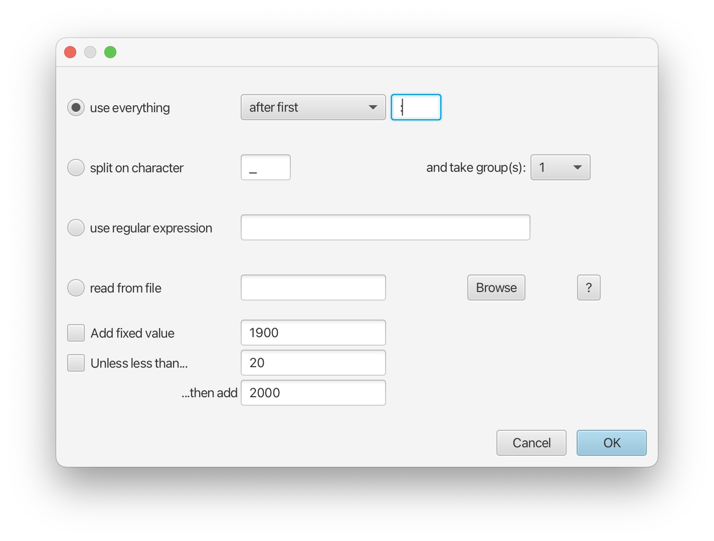
	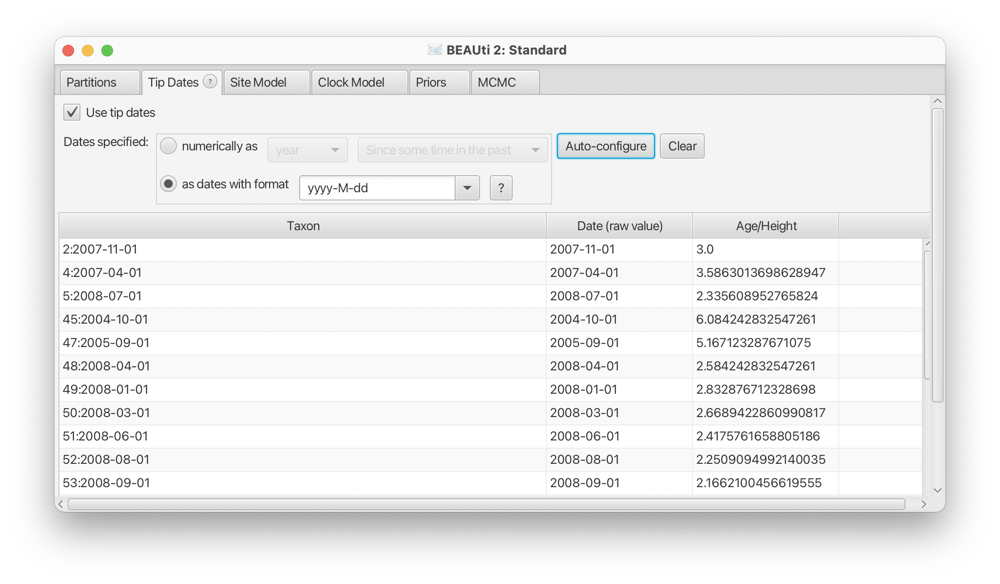
	<figcaption>Figure: Set up tip dates in the tip-dates panel.</figcaption>
</figure>

Now, we can set up the site model. We will use HKY+4G+I in this analysis.

> * Click the `Site Model` panel.
> * Select `HKY` from the drop down box with label `Subst Model`.
> * Change `Gamma category count` to 4.
> * Change `Proportion invariant` to 0.1 and select the `estimate` check box next to it.

The site model panel should look similar to this:

<figure>
	<a id="fig:BEAUti3"></a>
	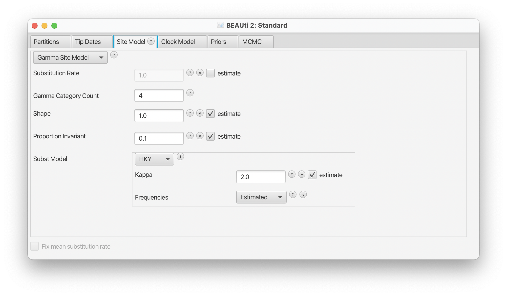
	<figcaption>Figure: Set up site model to HKY+4G+I.</figcaption>
</figure>

We will leave the clock model to a strict clock. Because we use tip dates, the clock rate is estimated by default. 
Next, we set up the BREATH tree prior.

> * Click the `Priors` panel.
> * Change the default Yule Model for tree prior to `BREATH`.
> * New priors appear for the block-count, block-start and end, transmission tree origin
and population size. 
> * Set the start value for origin to 10: click the `Initial` button for the `transmissionOrigin.t:roetzer40` parameter, and change the `value` entry from 10000 to 10, then click the `OK` button.
> * Set the lower bound for population size to 0.1.
> * Click on the triangle next to `Tree.t:roetzer40` to show the parameter so the `BREATH` tree likelihood.
> * Go to the population size prior (at the bottom), open the distribution by clicking the triangle next to the prior, and set the lower bound to 0.1 (this prevents the tree collapsing).

<figure>
	<a id="fig:BEAUti4"></a>
	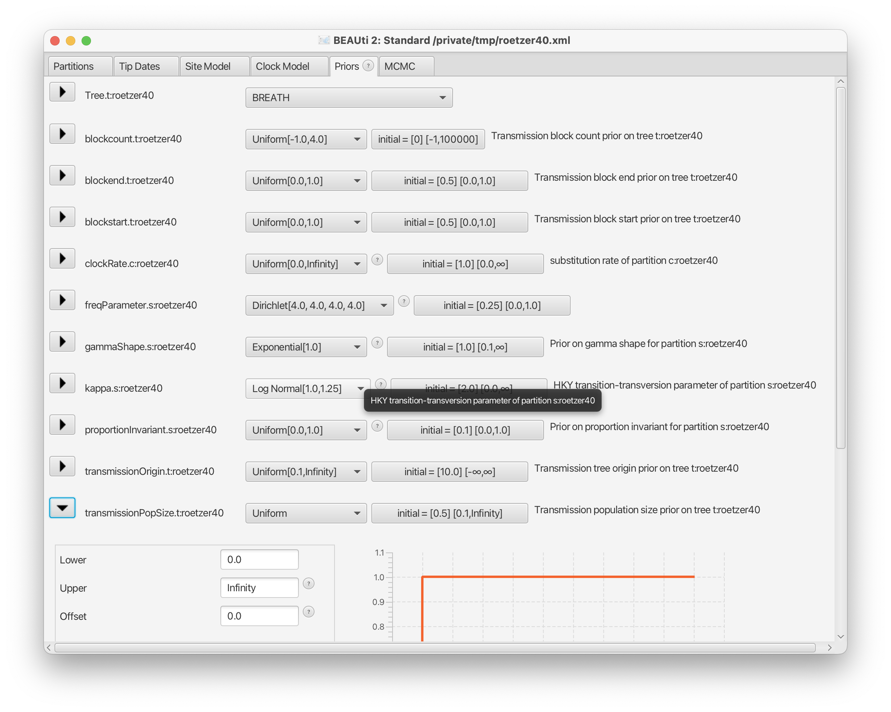
	<figcaption>Figure: Select the `BREATH` tree prior, and this is how the priors panel looks like.</figcaption>
</figure>


<figure>
	<a id="fig:BEAUti5"></a>
	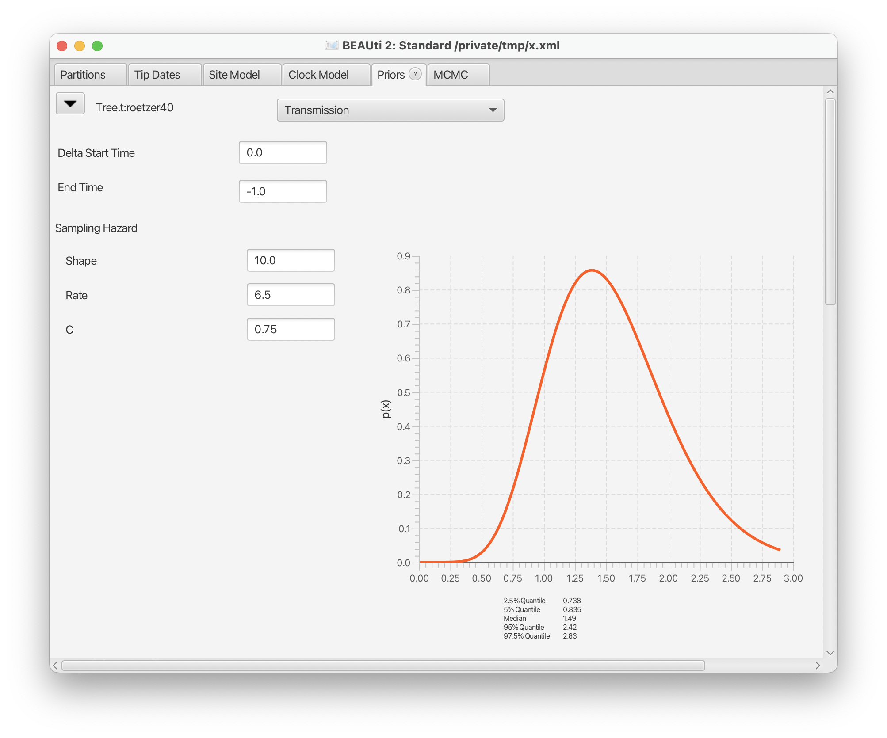
	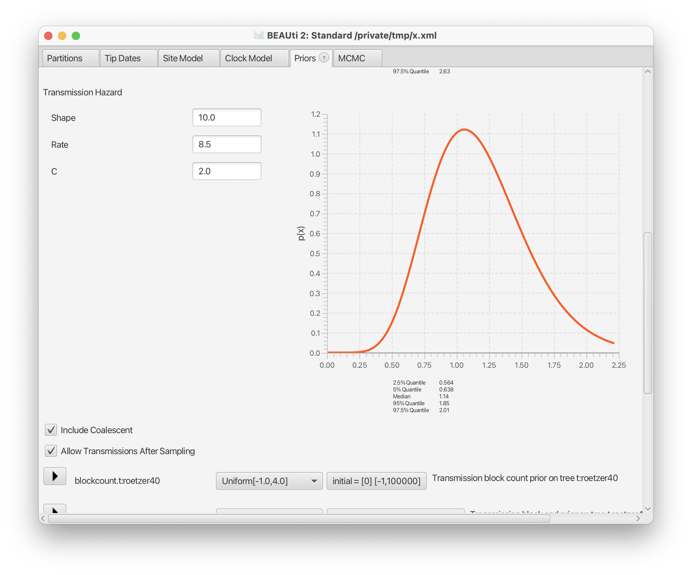
	<figcaption>Figure: Shows all options of the BREATH tree prior.</figcaption>
</figure>


The BREATH tree likelihood has the following components:
* samplingHazard: determines the hazard of being sampled. It has a sampling probability (`C` in the priors tab) and a `shape` and `rate` parameter for a Gamma distribution that determine the time of sampling after a host got infected.
* transmissionHazard: determines the hazard of transmitting an infection. It has an average number of transmissions `C` and a `shape` and `rate` parameter for a Gamma distribution that determine the time from infection to time of infecting another host. In general, the average transmission time should be larger than the average sampling time (so shape/rate of transmission should be larger than shape/rate of the sampling hazard).
* endTime: time at which the study finished relative to the latest sample. So, if the units of time is years, and the study stopped collecting samples 3 months after the latest sample, it means the endTime is 1/4 year after the latest sample, and endTime=-0.25.
<!--* deltaStartTime: time at which the study start till root of tree (optional, default: 0). -->
* origin: time at which the study start above the root of tree. Assumed to be at root if not specified.
* allowTransmissionsAfterSampling: flag to indicate sampling does not affect the probability of onwards transmissions. If false, no onwards transmissions are allowed (not clear how this affects the unknown unknowns though). (optional, default: true)
* includeCoalescent: flag for debugging that includes contribution from coalescent to posterior if true (default: true).

The two hazard functions probably need a bit of thought and knowledge to inform their parameters. For more details, we refer to the paper.


### Hyperpriors

The BREATH tree prior comes with four hyperpriors: block start, end and count and tranmission population size

* block start and end represent fractions on a branch, so should be in the interval from zero to 1 (and the associated parameters are bounded by these values). Be default, a uniform(0,1) prior is used. Unless you have good reasons to change, this can be left as is.
* block counts represent how many infections take place in a block. 
	* A value of -1 indicates there is not transmission on the branch
	* A value of 0 indicates there is 1 transmission on the branch, block start and end have the same value and determine where on the branch the transmission takes place.
	* A value of 1 or more indicates 1 or more transmissions happen in a block, one at block end and one at block start, so they block start and end differ for these branches.
	So, values below -1 do not make sense, and values over 4 indicate 5 transmission happen on a branch. Note that this many transmissions only tend to happen when there are very long branches in the tree, and suggest a sampling probability of hosts being on the low side of where the transmission tree model makes sense.
	The default prior is uniform in the range -1 to 4.
* A constant size population is assumed for the coalescent process inside each host. Together with the sampling and transmission hazard they determine the length of branches, so be aware the population size prior and parameters of the hazard functions interact with each other.
The prior on the population size is uniform [0, +Infinity) by default. If you observe a collapse of the tree during the MCMC coinciding with a collapsing value of the population size it may be worth increasing the value of the lower bound. For estimating marginal likelihoods through nested or path sampling, make sure to specify a reasonable upper bound in order to make the prior propper.
* A uniform prior is assumed for the origin of the tree, that is, the place where the host at the root of the tree got infected. The default is set to uniform [0, +Infinity). If you have any information about the age of the outbreak it makes sense to specify the upper bound and make this a proper prior.


Since we don't want the analysis to take too long, we only run for 5 million samples.

> * In the MCMC panel, set the chainLength to 5 million samples.
> * Optionally, you might want to reduce the log frequency of the screen logger to 100000 and that for the trace and tree logger to 2000.
> * Safe the file to `roetzer.xml`

<figure>
	<a id="fig:BEAUti6"></a>
	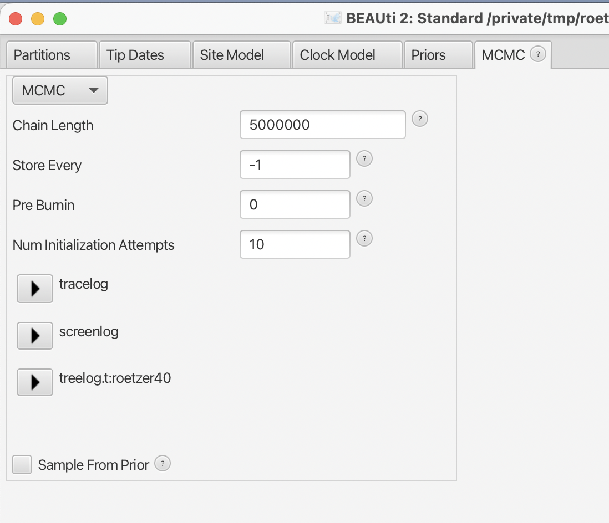
	<figcaption>Figure: MCMC settings.</figcaption>
</figure>

## Run with BEAST

> Run BEAST on `roetzer.xml`

This should not take more than 5 minutes, but if you don't want to wait that long you can use the data in the `precooked_runs` directory that comes with this tutorial.
The longer runs (marked with `long` in their name) are 

## Check convergence

> Run `Tracer`, and make sure all parameters have sufficiently large ESSs

<figure>
	<a id="fig:Tracer"></a>
	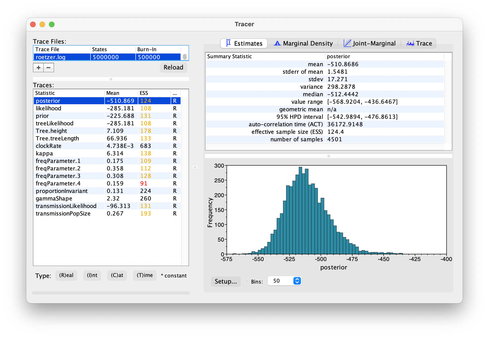
	<figcaption>Figure: Convergence of MCMC in Tracer.</figcaption>
</figure>

The short 5 million sample run has not quite converged yet, but the longer pre-cooked run does.


Inspect the tree file, for example in DensiTree. It shows that there is a lot of uncertainty in the tree distribution

<figure>
	<a id="fig:DensiTree"></a>
	
	<figcaption>Figure: Inspect the tree distribution in DensiTree.</figcaption>
</figure>

## Visualising Who-Infected-Who

The `WIWVisualiser` app creates an SVG files that visualises who-infected-who. 
To start the `WIWVisualiser` app, 

> * Select the `File =>> Launch apps` menu in BEAUti.
> * Select `WIWVisualiser` from the list of apps, and click the `Launch` button.
> * In the menu that pops up, select the tree file (or select `roetzer-roetzer40.trees` from the pre-cooked runs)
> * Select an appropriate output file name
> * Set the `Partition` to `roetzer40`
> * Click the `OK` button, and after a little while a message in the terminal appears that the svg file has been written.
> * Close the terminal window.

<figure>
	<a id="fig:WIWVisualiser"></a>
	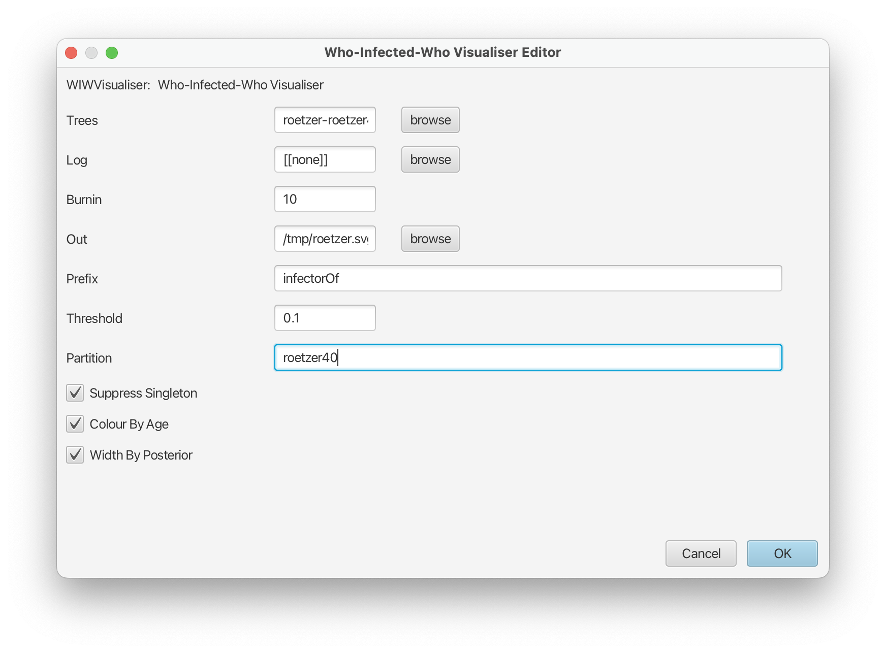
	<figcaption>Figure: Who-infected-who visualiser options</figcaption>
</figure>


Alternatively, you can run it from the command line like so:

```
/path/to/applauncher WIWVisualiser -tree roetzer-roetzer40.trees -partition roetzer40 -out /tmp/roetzer.svg
```

You can open the svg file in a web browser for closer inspection, or in a vector drawing program like Inkscape or Illustrator.


<figure>
	<a id="fig:WIWVisualiser2"></a>
	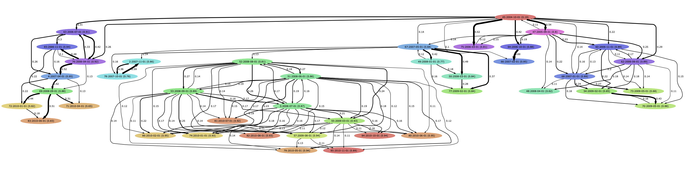
	<figcaption>Figure: Part of the who-infected-who network shown in a browser.
The numbers on edges are the probability that the host at the tail infected the host at the head.
Numbers in brackets represent the total probability a host was infected by another sampled host (so one minus that number is the probability it was infected by a host that was not sampled).
	</figcaption>
</figure>


WIWVisualiser has the following options:

* trees (TreeFile): tree file file with transmission trees. (optional, default: [[none]])
* log (LogFile): trace file containing infectorOf log. Ignored if tree file is specified (optional, default: [[none]])
* burnin (Integer): percentage of trees to used as burn-in (and will be ignored) (optional, default: 10)
* out (OutFile): output file, or stdout if not specified (optional, default: /tmp/wiw.svg)
* matrix (OutFile): transition probability matrix output file, potentially useful for post-processing e.g. visualising as heat map. Ignored if not specified.
* prefix (String): prefix of infectorOf entry, e.g., infectorOf (optional, default: infectorOf)
* threshold (Double): probability threshold below which edges will be ignored. (optional, default: 0.1)
* partition (String): name of the partition appended to `blockcount, blockend and blockstart` (optional)
* suppressSingleton (Boolean): do not show taxa that are not connected to any otehr taxa (optional, default: true)
* colourByAge (Boolean): colour nodes in output by node age. All blacks if false (default true)
* widthByPosterior  (Boolean), draw line between nodes with widths proportional to posterior support (default true)
* saturation (Float): saturation used when colouring nodes. (optional, default: 0.7)
* brightness (Float): brightness used when colouring nodes. (optional, default: 0.7)
* filter (String): search/replace regular expression for filtering labels. Should be of the form '/searchRegExp/replaceString/'. Ignored if not specified (optional)

## Transmission Tree Statistics

The `TransmissionTreeStats` app provide statistics of set of transmission trees. It has the following options:

* trees (TreeFile): tree file file with transmission trees. (optional, default: [[none]])
* burnin (Integer): percentage of trees to used as burn-in (and will be ignored). NB default 0 (optional, default: 0)
* partition (String): name of the partition appended to `blockcount, blockend and blockstart` (optional)
* out (String): directory where to put files with tranmsision & sampling time stats (optional, default: /tmp)

This is a sample output of `TransmissionTreeStats`:
```
average internal Branch Length = 0.62
average leaf transmission count = 1
average internal transmission count = 1
average transmission count per tree = 170
average unsampled hosts per tree = 85
average maximum block count = 1
```

It also produces two log files in the specified output directory called `timeTillSampling.dat` and `timeTillTransmission.dat`.
The `timeTillSampling.dat` can be opened in `Tracer` and reveals for each sampled host the time from first infection to sampling.
It can be revealing in that for some hosts the distribution is multi-modal.

<figure>
        <a id="fig:TransmissionTreeStats"></a>
        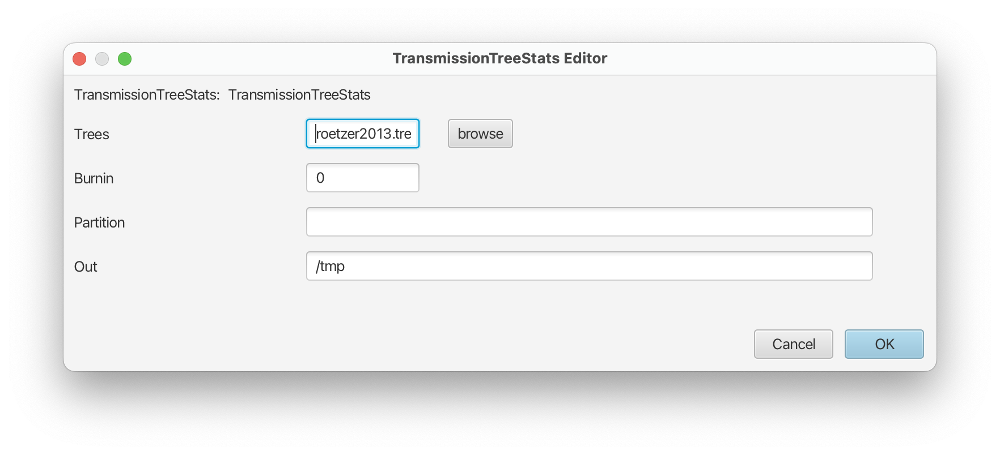
        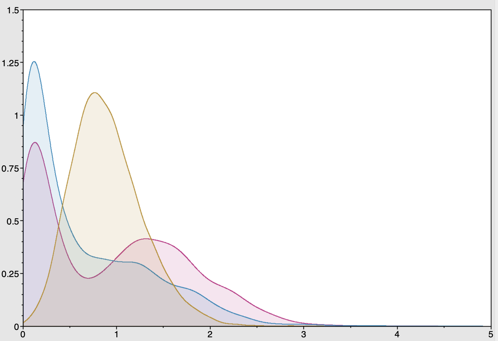
        <figcaption>Figure: TransmissionTreeStats GUI version (left) and distributions of time-till-sampling (right) for three selected hosts.</figcaption>
</figure>

The `timeTillTransmission.dat` file contains information about the time it takes between the first infection of a host and the time the host infects another host. 
It also records the time till infects a second host.
If no host(s) are infected, -1 is output -- this shows up when you open the file in Tracer as a peak around -1.
Checking the time-till-first-tranmission and time-till-second-transmission can be useful in verifying the transmission hazard is properly parameterised.


----

# Useful Links

- BEAST 2 website and documentation: [http://www.beast2.org/](http://www.beast2.org/)
- [Bayesian Evolutionary Analysis with BEAST 2](http://www.beast2.org/book.html) 
- Join the BEAST user discussion: [http://groups.google.com/group/beast-users](http://groups.google.com/group/beast-users)

----

# Relevant References


